# C4 — AeroServer

Architecture in the C4 model, one diagram per process. Every module, route, table and rule named
here was read out of the running code and the live schema.

- **L1 Context** — who talks to the server
- **L2 Container** — the runnable pieces
- **L3 Component** — inside the server, one diagram per process

Colours: blue is the server, green writes, red refuses.

---

## L1 — Context

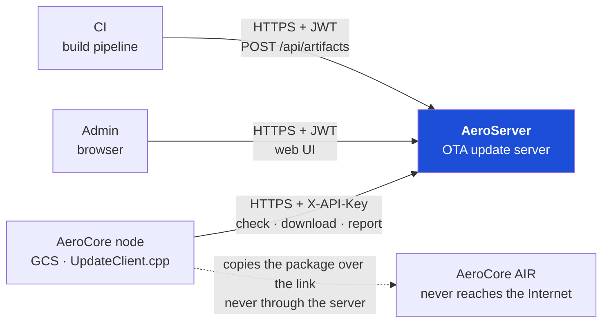

**One question, one answer.** A request says which device is asking — serial, platform, version,
system — and the answer is that system's release line. Nothing else enters the decision.

Only the GCS reaches the server. The AIR gets the package the GCS copies over the link, which is
why one artifact may cover several platforms: the downloaded file has to be applicable on both
sides even though only one side asked.

### Surface

| Audience | Endpoints |
|---|---|
| Node | `GET /api/v1/update/check` · `GET /api/v1/update/download/{version}` · `POST /api/v1/update/report` · `GET /api/v1/health` |
| Admin | `/admin/api/…` — auth, catalog, uploads, systems, channels, fleet, reports, audit, signing key, TLS |

---

## L2 — Container

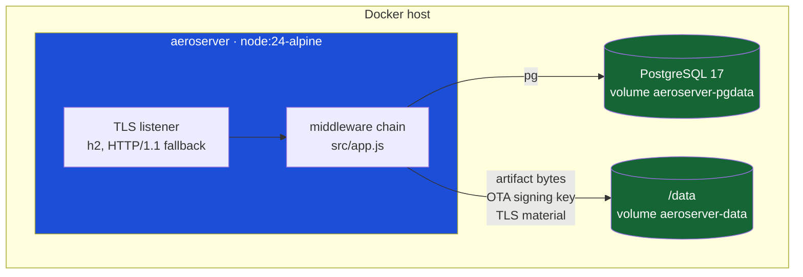

**The listener speaks HTTP/2 with `allowHTTP1: true`, negotiated per connection by ALPN.** The
fallback is not a courtesy: the node's update client is httplib, which is HTTP/1.1 only, so an
h2-exclusive listener would take the whole fleet offline the moment it started. What h2 buys is
the admin UI — a browser loads the page, its script, its stylesheet and several API calls over
one connection instead of six handshakes. The fleet gains nothing from it: one node, one large
file, one connection.

Node's compatibility API gives handlers the same `(req, res)` shape, so the middleware chain
below is protocol-agnostic — with one trap. **HTTP/2 has no `host` header**; the authority
arrives as `:authority`, and a server reading the wrong one builds a broken URL on exactly the
half of its connections that negotiated h2.

The volumes are separate on purpose. `pgdata` can be rebuilt from a logical backup; `/data`
holds the **OTA signing key**, and losing that means every node rejects every manifest from then
on, because the `key_id` provisioned into each device no longer matches anything.

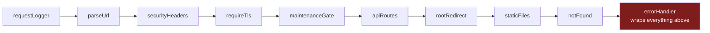

`requireTls` sits before the router, so `/admin` refuses plaintext with 426 before any handler
runs and no handler has to remember to.

### Layers

| Layer | Rule it obeys |
|---|---|
| `core/` | no domain knowledge — tar, range, jwt, router, files |
| `domain/` | pure; returns findings, never throws, never touches a database |
| `repositories/` | SQL only |
| `services/` | orchestration and policy |
| `controllers/` | HTTP shape in, HTTP shape out |

---

## L3.0 — `system`, and how it travels

Every decision is scoped to one system. Rather than thread `system` through every table and
request, the schema makes **the version carry it**:

```sql
release_pkey    PRIMARY KEY (version)     -- globally unique across all systems
release.system  NOT NULL REFERENCES system(name)
channel_pkey    PRIMARY KEY (system, name)
```

A version belongs to one system for as long as it exists, so anything reached through a version
is that system's by construction. Publishing defends the other direction: a second artifact for
a version whose release belongs to another system is refused, because a number reused across
systems would make every node running it resolve to the wrong product.

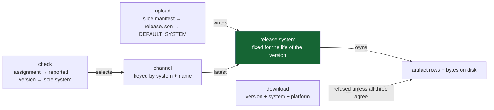

| Path | Scoping |
|---|---|
| **Upload** | reads `system` out of the bundle, refuses a name this server does not have, writes it onto the release |
| **Check** | places the node into a system first, then only looks at `channel(system, …)` — a drone is never offered a GCS release |
| **Download** | **requires** system *and* platform; a request that cannot name its product, or asks for a package with no variant it can use, is refused rather than served |

Bytes live at `artifacts/<version>/<file>` — by version, not by system, for the same reason. A
per-system directory would encode one fact in two places and let them disagree.

> **The node never learns what a system is.** It echoes back the `url` the check response gave
> it, and that url already carries `?system=`. Every download therefore names its product with
> no client change — `url` is not covered by the signature, which is what makes adding to it
> safe.
>
> On the download endpoint `system` and `platform` are both **keys**: either absent is `400`,
> and a mismatch on either is `404` — the same answer as a version that does not exist, because
> telling those apart would leak what other systems hold.
>
> The redundancy is the point. A version already identifies its release, so neither parameter
> adds information; each adds a *refusal*. `system` stops a device being given another product's
> firmware, which replaces its plugin set and its config in one step. `platform` stops it being
> given a package with no variant it can use — which the node records as
> `no_variant_for_platform`, a non-fatal skip, so the update reports success having changed
> nothing.

---

## L3.1 — Upload, in two steps

The only process that deliberately writes **nothing** in its first half.

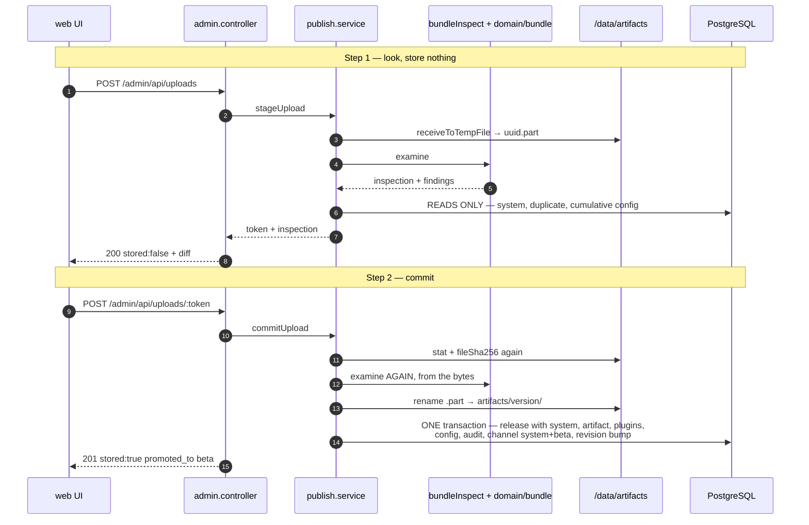

| Property | Why |
|---|---|
| The token **is** the temp file's name | no bookkeeping of its own; `pruneTempFiles` sweeps `.part` older than an hour, and that is the entire expiry mechanism |
| Step two **re-examines** | the catalog can move between the calls — the token says *which bytes*, never *still valid* |
| The token must be a **UUID** | it is joined onto a path; without the shape check it is a traversal into `ARTIFACTS_DIR` |
| Rename **before** the transaction | a downloader sees the old file or the new one, never a half-written one |

### Inside `examine`

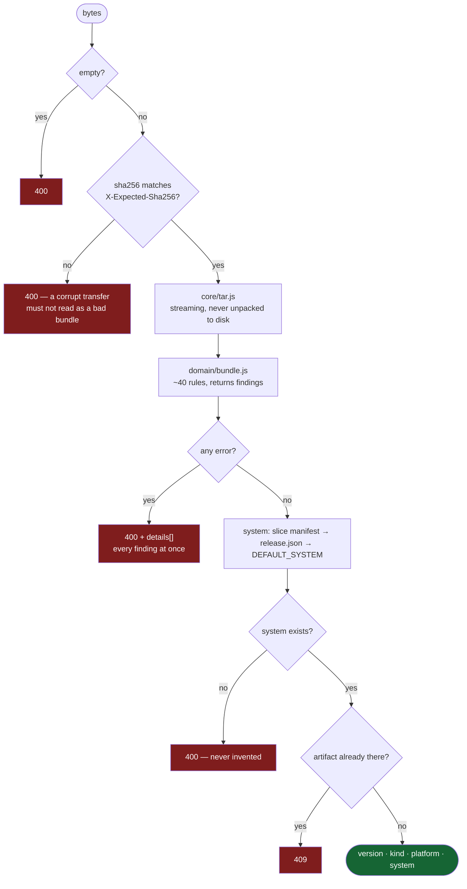

`tar.js` reads the whole stream once: tar has no central directory, gzip cannot seek, and half
the rules are proofs of *absence*, which can only be settled at the end.

The rule that justifies the rest is `core_slice_version_mismatch` — the slice inside the package
stamped with a version different from the bundle's. The node compares the *slice*, so every
device would download the package and reply `skipped/same_version` with no error anywhere.

---

## L3.2 — A node asks for an update

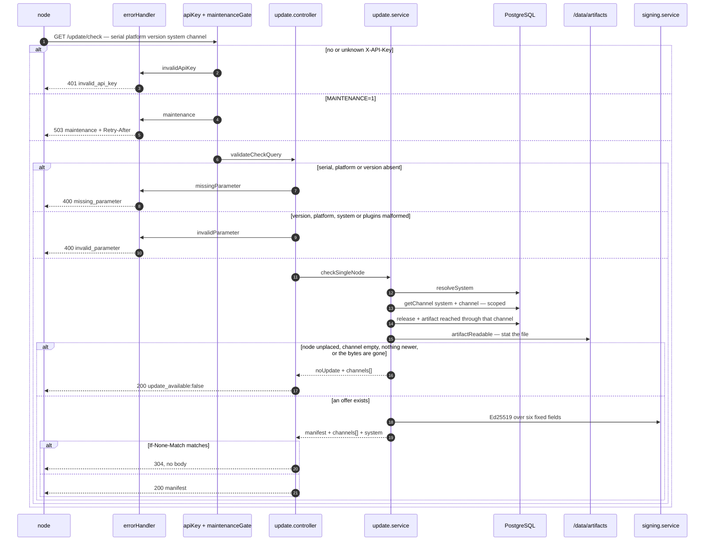

**Four of those branches end in the same 200.** A node that cannot be placed, a channel that
hands out nothing, a version already current and an artifact whose file has vanished are
indistinguishable on the wire — all four say *nothing for you*, and only the last is a fault.
That is deliberate: a node has nothing useful to do differently in any of them. The cost is that
a broken release looks exactly like a healthy fleet, which is why the server logs the unreadable
case as an error and the admin catalog flags it.

**No 429.** This server does not rate limit; [§1](update-server-api.md) permits the code, and a
deployment behind a proxy may add it, but nothing here emits one.

**Always 200 with a body, never a bare 204.** `UpdateClient::check` treats any other status as a
broken server and never parses the body, so a 204 would read as a fault rather than as "you are
current".

Three fields ride alongside the signature and are covered by none of it:

- **`url`** — already carrying `platform` and `system`, so the node downloads the right
  product's bytes by echoing a string back.
- **`channels[]`** — present on *both* shapes. A node sitting on a channel this server does not
  have receives the no-update shape forever, and that list is the only thing that can correct
  it; `sync_channel_options` writes it into `update.channel.options` on the device.
- **`system`** — what the answer is for, so a log line or a support ticket does not need the
  catalog to be readable.

### Placing a node

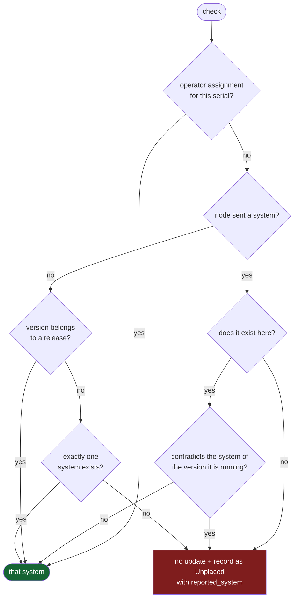

Two branches refuse to guess. An unknown name is a build-script typo, and a contradiction means
either a device that was just moved or a mis-stamped build — indistinguishable from here.
Neither is auto-created and neither is settled by picking one.

---

## L3.3 — Downloading

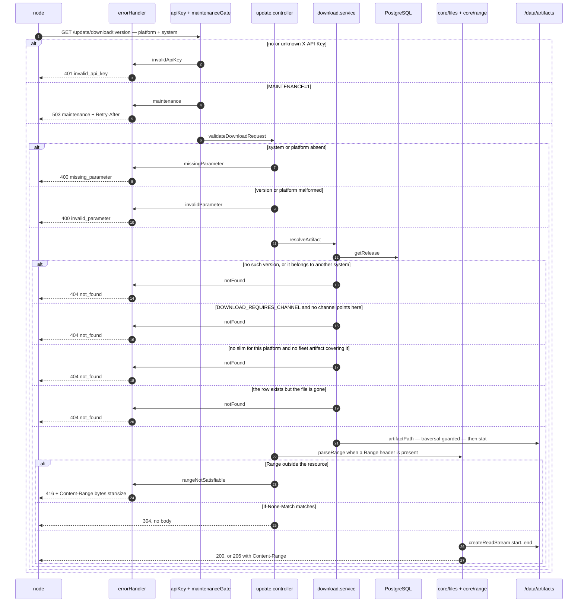

**Four different faults, one status.** Unknown version, wrong system, uncovered platform and a
missing file all answer `404`. Telling them apart would leak which versions exist in systems the
caller has no business with — so the discrimination lives in the server log and the admin
catalog, not on the wire.

`Range` support is not a nicety: a satellite link drops mid-transfer routinely, and re-fetching
30 MB from zero on every drop is what makes OTA unusable in the field.

---

## L3.4 — Reporting

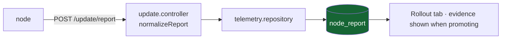

A failed report gates nothing. The node treats an error here as non-fatal and does not retry, so
this is evidence for whoever decides to promote — never a control point.

---

## L3.5 — Promoting beta to stable

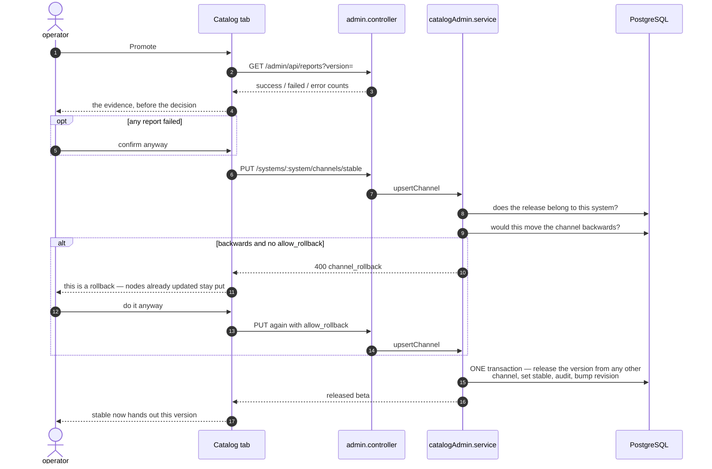

**One release runs on one channel.** Promoting is a *move*: whichever channel held that version
lets go of it in the same transaction. Otherwise beta and stable hand out the same build, every
node gets the same thing whichever channel it sits on, and the test stage means nothing.

**Refusing to move a channel backwards** looks redundant because no node downgrades — an offer
must be strictly newer. But a device provisioned *after* the slip takes whatever the channel
says, and the fleet splits into two halves that are both healthy by every check the protocol
makes. `allow_rollback: true` is the deliberate override, recorded in the audit log.

With pause, pin and deny gone, that override is the **only** brake on a bad release. It stops
the spread; it recalls nothing already installed.

---

## L3.6 — Authentication

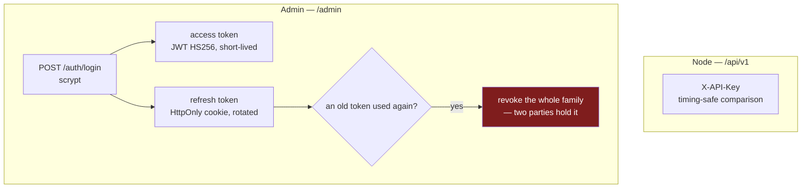

The two mechanisms never meet: a node never holds a JWT, an admin never uses an API key.

---

## L3.7 — Boot

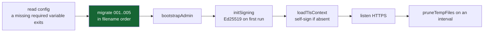

Migrations run before the port opens, so the server never serves on a schema of the wrong
version.

---

## Data

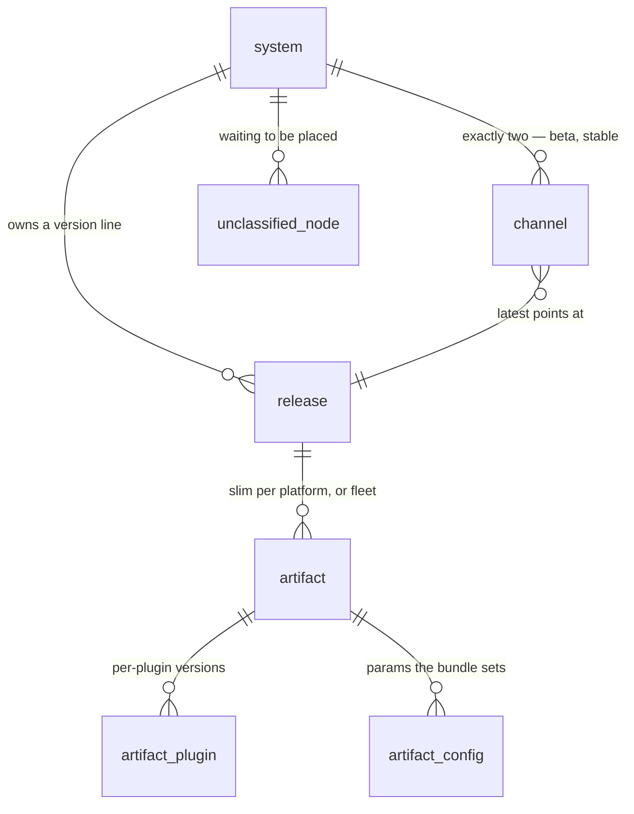

Operational tables sit outside that shape: `check_log`, `node_report`, `audit`, `catalog_rev`,
`admin_user`, `refresh_token`, `login_attempt`, `schema_migrations`.

`catalog_rev` is one number, incremented whenever the catalog changes. It goes into the ETag of
every check answer — without it a node holding a 304 would never see a channel that has just
been pointed somewhere else.

### Migrations

| | |
|---|---|
| `001_init` | releases, artifacts, channels, auth, telemetry |
| `002_bundle_inspection` | the stored inspection report; the partial unique index that finally makes two concurrent fleet uploads impossible |
| `003_systems` | systems; channels re-keyed to `(system, name)` |
| `004_reported_system` | what an unplaced node claimed to be |
| `005_fixed_channels` | beta and stable for every system; **drops** pin, deny and pause |

---

## What the design is defending against

Three apply-time outcomes are recorded as `skipped`. None is an error, the node still returns
`ok`, and the dashboard still goes green:

| Reason | Cause | Where the server stops it |
|---|---|---|
| `same_version` | the core slice is stamped with the version already installed | `core_slice_version_mismatch`, at upload |
| `system_mismatch` | the package was built for another product | placing the node by system; system checks at upload and at download |
| `no_variant_for_platform` | no variant matches this platform | `platform` is required on download and checked against what the package covers — 404 rather than bytes the node cannot use |

They are non-fatal by design — on a multi-platform artifact most nodes skip most of it, and that
is correct. Which is exactly why they cannot double as error reporting, and why the server has
to catch each one before publishing rather than waiting for reports that will say it worked.

The same shape appears without the node's help. A catalog row whose bytes have gone looks
healthy from every angle: the release is listed, a channel points at it, and every node is told
there is no update — the check path declines to offer an artifact it cannot read, and says so
only in the server log. The catalog now marks those rows `bytes missing`.
