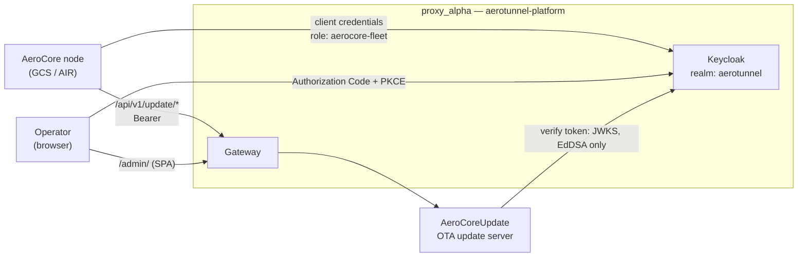
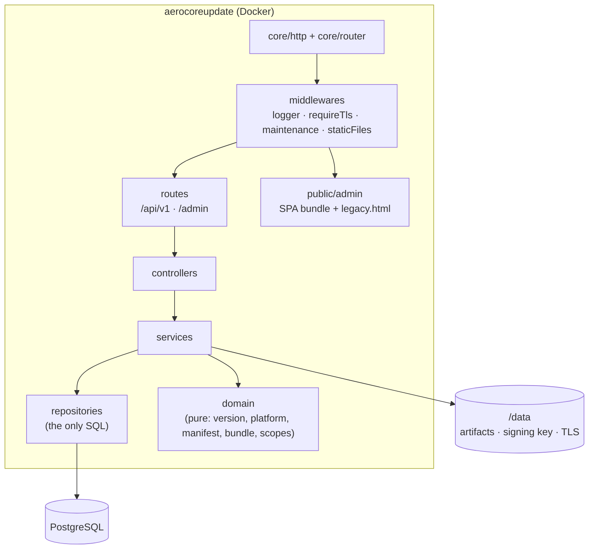
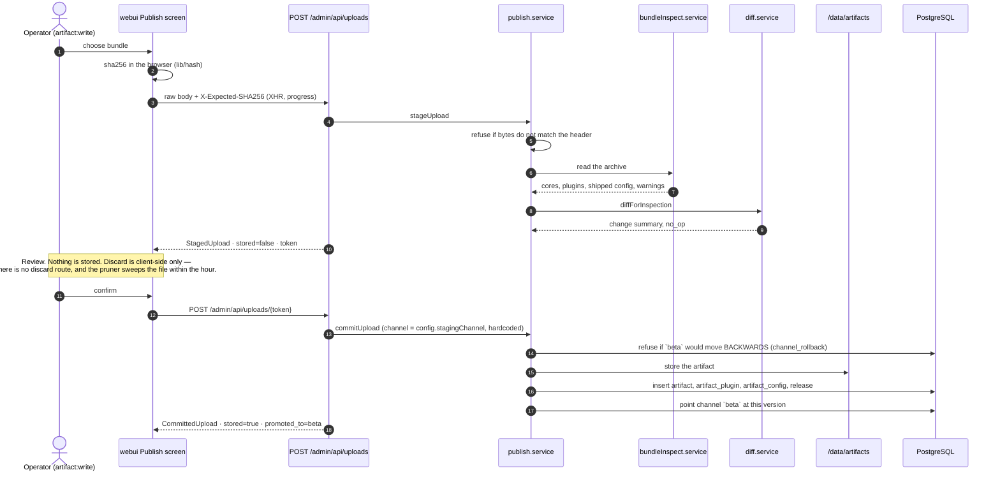
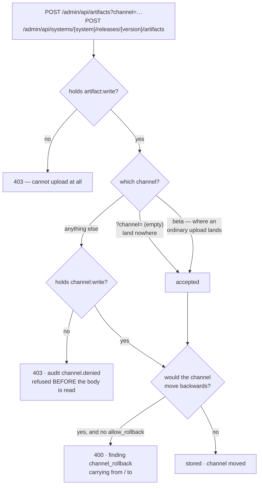
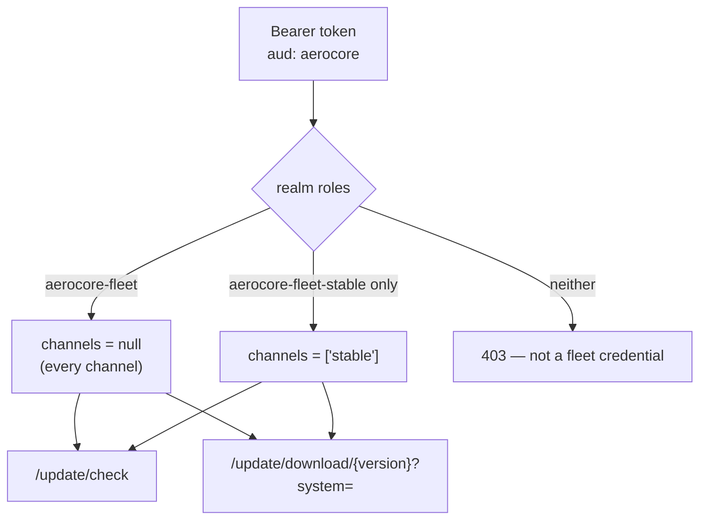
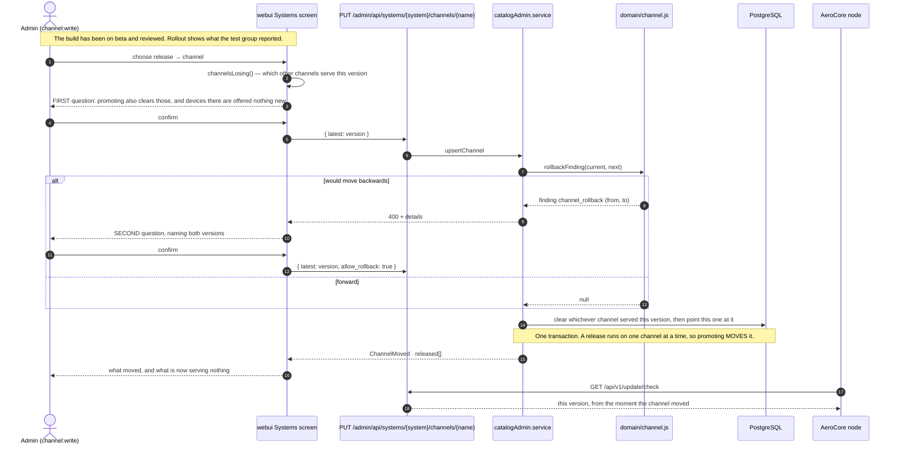
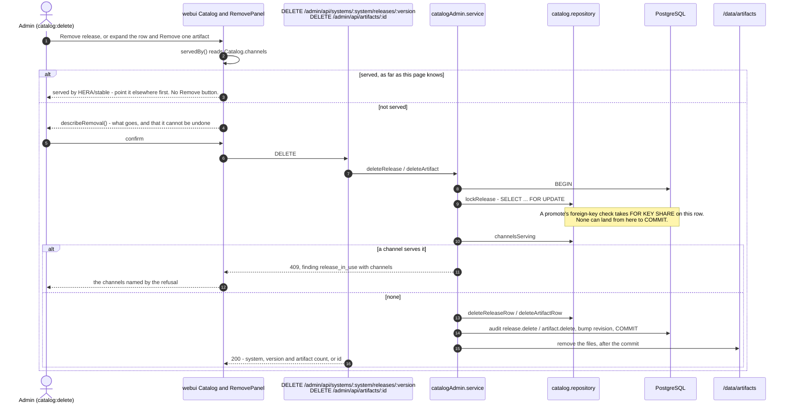
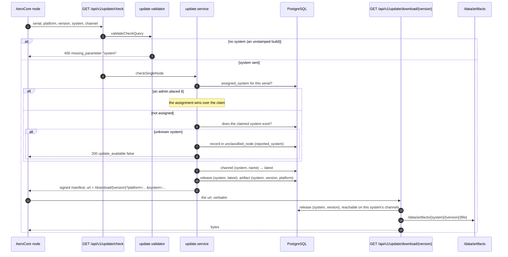

# C4 — AeroServer

Rebuilt 2026-09-10. The previous version described the architecture before this server
became a microservice of proxy_alpha, so its L1 and L2 were wrong and it was not restored.

Every module, route and table named here is readable out of code that runs. Nothing is drawn
that does not exist, and nothing deleted stays drawn (Constitution VII).

## L1 — Context

**Everything reaches this server through proxy_alpha's gateway, and everything signs in
first — nodes included.** A node is not an exception to identity: it obtains a token from the
realm like anyone else, holds `aerocore-fleet`, and presents it as a bearer. `FLEET_AUTH_MODE`
is `jwt`, so the shared `X-API-Key` is no longer accepted.

> ⚠️ **The gateway half is not deployed yet.** `docker-compose.yml` still publishes `9443:9443`
> on its own network, so a node currently dials this server directly. Until that changes, the
> diagram above describes the intended architecture rather than the running one. Three things
> move together when it does: joining proxy_alpha's network, dropping the published port, and
> setting `PUBLIC_BASE_URL` — signed manifest URLs are built from it, and a node behind the
> gateway cannot fetch a URL that names an internal address.

**AeroCoreUpdate holds no user identity, and no exception.** Keycloak, hosted by proxy_alpha,
issues every operator token; this server verifies them and maps realm roles onto scopes. It
keeps no account of its own and no credential that opens itself, so while the realm is
unreachable the admin API is unreachable too — accepted deliberately (Constitution I, 2.0.0).

Tokens must be signed **EdDSA**. An AeroCore node built for Android has no OpenSSL, so RS256
is unverifiable there — a fleet constraint, not a preference.

## L2 — Container

The admin UI is built from `webui/` in a separate image stage and lands in `public/admin`.
The previous UI ships beside it at `/admin/legacy.html` until every screen is ported.

### Layers

`routes → controllers → services → repositories`. `repositories/` is the only place that
touches SQL; `domain/` is pure protocol rules with no I/O.

## L3.1 — Publishing a release

Two steps by design. Staging reads the bundle and describes it while storing **nothing**;
only a person's confirmation writes anything.

**`stable` does not move here, and cannot.** `commitUpload` takes no channel argument, so the
publish screen has nowhere to ask for one. Promoting `beta → stable` is a separate act by an
admin holding `channel:write` — the only action in this system that reaches an aircraft, and
it is **[L3.3](#l33--promoting-a-release-to-the-fleet)**. The two sections are one workflow:
nothing published here reaches a device until that one happens.

### Who may ask for somewhere other than beta

The screen above is one of two ways in. The other is the one-shot upload a script uses, and it
DOES take a channel — which is where the two rights separate:

**The permission question is answered before a byte of the body is read.** That ordering is the
feature, not an optimisation: until 004 a publisher naming `stable` got past the gate and was
refused later by the archive reader, which meant the gate was not holding at all.

`config.stagingChannel` is the literal `beta` and is what the rule is anchored on —
deliberately NOT `config.autoPromoteChannel`, which is read from the environment and would
therefore let a configuration change hand every publisher the fleet.

The backward-move guard (`domain/channel.js`) is reached by **every** path that points a
channel somewhere: this upload, the two-step commit above, and the promote endpoint in L3.3.
One function, one message, one override — two implementations is how the careful one drifts
from the other.

Refusals a screen must handle rather than report as a generic failure:

- **`config_only_needs_platforms`** — a bundle carrying only configuration names no target
  platforms. The server will not guess; the operator is asked and the upload is retried with
  `?platforms=`.
- **`channel_rollback`** — the channel would go backwards. Carries `from` and `to` so the
  screen can state the move; answered by re-sending with `allow_rollback`. The staged bundle
  survives the refusal precisely so that answer costs nothing.
- **403 on `?channel=`** — the account may upload but not publish. The message names the
  missing permission and says the upload itself was fine.
- **413** — larger than `UPLOAD_MAX_BYTES`. The limit is in the message.

## L3.2 — Which builds a node may pull

A node signs in as an account, and inherits that account's channel policy. Deciding a build
is ready to fly is what `beta` means, and it is not a pilot's call.

| Account | Realm role | May pull |
|---|---|---|
| admin, engineer | `aerocore-fleet` | every channel, `beta` included |
| pilot | `aerocore-fleet-stable` | only what `stable` points at |
| anyone else | — | nothing; the fleet API is closed to them |

**Both routes are gated, and that is the point.** Refusing on `/update/check` alone would be
theatre: a version number is not a secret, and `/update/download/{version}` resolves by
system and version. So the credential's channel list is passed to artifact resolution too, and a
pilot asking for a known `beta` version by number is refused there as well.

Refused, never redirected. A device that asked for `beta` and was quietly handed `stable`
would report success and run something nobody chose for it — and the mistake, usually one
line in a node's config, would never surface.

## L3.3 — Promoting a release to the fleet

The other half of publishing. L3.1 gets a build onto `beta`; this is how it reaches an
aircraft, and it is the only flow in this system that does.

**Two questions, and they are different questions.** The first is asked before anything is
sent and only when it applies: this release is serving another channel, and promoting takes it
off there — a test group about to go empty. The second exists only because the server refused,
and names both versions.

**The comparison belongs to the server.** No client predicts a rollback. `webui/src/lib/promote.ts`
holds a state machine in which `confirmingRollback` is reachable only from a refusal, and a
test asserts the file compares no version strings. A second opinion in the browser about the
one action that reaches an aircraft is one opinion too many.

The same guard, from the same `domain/channel.js`, is on every path that points a channel
somewhere — this one, the one-shot upload and the two-step commit in L3.1.

A release a channel serves cannot be removed, in whole or in part, until the channel points at
another one — see [L3.4](#l34--removing-a-build).

## L3.4 — Removing a build

An administrator holding `catalog:delete` removes a release with every artifact in it, or a
single artifact, from the Catalog screen. What makes that safe to offer is that nothing a channel
is serving can be removed: a channel pointing at a release with nothing to download for a
platform answers every device there "no update", which looks exactly like a fleet that is up to
date.

**Two guards, on purpose.** The lock is what the removal paths rely on: it orders the check
before the delete so a promote cannot land between them, and it lets the refusal name the channel.
`channel_latest_fkey` is `ON DELETE RESTRICT` (migration 011) so that the database refuses as
well, on any path — including ones nobody has written yet. Until 011 it was `ON DELETE SET NULL`:
a release deleted while it was served did not fail, its channel was quietly pointed at nothing.

No key runs from a channel to an artifact, so for a single artifact the lock is the whole
guarantee.

The screen shows the channels **from the refusal** when there is one, not from its own catalog:
the catalog is as old as its last fetch, and the case that separates the two is a channel moved
onto the release after the page loaded.

Files are removed after the commit: an orphaned file is recoverable, a row pointing at bytes
that are gone is not.

## L3.5 — A version number belongs to a system

A release is **(system, version)**, not a version. HERA and HERAHUB may both ship `0.2.0`; they
are two releases with two sets of bytes. Until migration 012 the number was global, because the
node could not say which product it was and the version it reported was the only way to place
it. The node now sends `system` on every check, so the number no longer has to carry that.

**The node must say which system it is.** The version cannot place it any more: `0.2.0` may be
a release in several systems. A check without `system` is refused with `400 missing_parameter`
rather than answered "no update" forever — a build that was never stamped is told why. A system
this server does not have is still not an error: the node is parked in `unclassified_node` for
an admin, exactly as before.

**Every lookup is scoped by system.** Upload checks for a duplicate only within the bundle's
system; a channel can point only at a release of its own system (the database holds that too:
`channel(system, latest) → release(system, version)`); removing `drone/6.0.0` leaves
`gcs/6.0.0` alone; the diff baseline is the previous release of the same system.

**Release routes live under their system:** `POST /admin/api/systems/{system}/releases`,
`PATCH|DELETE /admin/api/systems/{system}/releases/{version}`, and the one-shot
`POST /admin/api/systems/{system}/releases/{version}/artifacts`. On that last one the bundle is
still the source of truth: a system in the path that disagrees with the bundle's is refused
(`system_mismatch`), and the path's is used only when the bundle names none.

**Files are per system:** `/data/artifacts/{system}/{version}/{file}`. Under the old
`{version}/` layout the second system's upload would have renamed its bytes over the first's.
`artifactLayout.service` moves files left in the old layout at every boot, right after the
migrations, and does nothing once there is nothing to move.

Rollout reports carry only the version a node moved to (`node_report.to_version`), so the
Rollout screen filters by version number and cannot tell two systems' `0.2.0` apart.

## Data

| Table | Holds |
|---|---|
| `release`, `artifact` | the catalog: versions, and the files serving each platform |
| `artifact_plugin`, `artifact_config` | what inspection found inside a bundle |
| `channel` | where `beta` and `stable` point, per system |
| `system` | the kinds of device AeroCore runs on, each with its own version line — a release is keyed by (system, version) |
| `unclassified_node` | nodes claiming a system this server does not have, awaiting an admin |
| `check_log`, `node_report` | what the fleet asked for, and what it reported back |
| `admin_user` | one row per Keycloak subject that has signed in — what `/auth/me` reports and what cutting an account's sessions stamps |
| `registration_attempt` | per-address ceiling on the self-service sign-up form, which creates accounts in the realm rather than here |
| `audit` | actions worth a trace, including reads of the shared fleet keys |
| `signing_key_cert` | a root-signed certificate for an OTA signing key |
| `catalog_rev` | catalog revision, used in the ETag a node caches against |
| `schema_migrations` | applied migrations |

Artifacts themselves are files under `/data/artifacts/{system}/{version}/`, not rows. The OTA
signing key is a file too, and never enters the database.

### Version per system (migration 012)

`012_version_per_system.sql` re-keys the catalog:

- `release` primary key is **`(system, version)`**; it was `version`.
- `artifact` gains `system`, filled from its release before the key changed.
  `artifact(system, version) → release(system, version)` is `ON DELETE CASCADE`; the unique key
  is `(system, version, kind, platform)`, and `artifact_fleet_uniq` is `(system, version)`.
- `channel_latest_fkey` is `channel(system, latest) → release(system, version)`, still
  `ON DELETE RESTRICT`.

### Removal (feature 005)

- `channel_latest_fkey` is **`ON DELETE RESTRICT`** since `011_channel_latest_restrict.sql`
  (re-keyed to `(system, latest)` by 012). It was `ON DELETE SET NULL`, which emptied a channel
  rather than refusing to delete what it served.
- `artifact → release` stays `ON DELETE CASCADE`: removing a release removes its artifacts.
- Files under `/data/artifacts/<system>/<version>/` are removed after the transaction commits.
